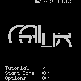
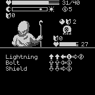

# GALDR

GALDR is an adventure game inspired by roguelikes like Slay the spire and fighting games.

This is a roguelike with realtime combat where your actions occur when you issue special moves on your controller.  Experience 40+ events spanning 9 areas!

This game was created as part of the [WASM-4 JAM #2](https://itch.io/jam/wasm4-v2).




## Building

Build the cart by running:

```shell
zig build 
```

Optionally bundle the game with (requires wasm-opt from binaryen) :

```shell
zig build bundle
```

Then run it with:

```shell
w4 run zig-out/lib/galdr.wasm
```

For more info about setting up WASM-4, see the [quickstart guide](https://wasm4.org/docs/getting-started/setup?code-lang=zig#quickstart).

## Links

GALDR on
- [Itch](https://jonathand.itch.io/galdr)
- [GitHub](https://github.com/jonathanderque/galdr)
